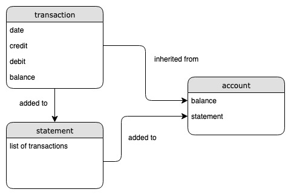

# Bank tech test

## Specification

### Requirements

* You should be able to interact with your code via a REPL like IRB or the JavaScript console.  (You don't need to implement a command line interface that takes input from STDIN.)
* Deposits, withdrawal.
* Account statement (date, amount, balance) printing.
* Data can be kept in memory (it doesn't need to be stored to a database or anything).

### Acceptance criteria

**Given** a client makes a deposit of 1000 on 10-01-2012  
**And** a deposit of 2000 on 13-01-2012  
**And** a withdrawal of 500 on 14-01-2012  
**When** she prints her bank statement  
**Then** she would see

```
date || credit || debit || balance
14/01/2012 || || 500.00 || 2500.00
13/01/2012 || 2000.00 || || 3000.00
10/01/2012 || 1000.00 || || 1000.00
```

## How to use

- clone this repository
- Run:
```
bundle install
```
- Run tests:
```
rspec
```

## Approach

### Model



### Structure

After modelling the test I created files and corresponding test files for each class as modelled. Once these were completed and had the functionality required, the last step was to display the statement in the format required.

## IRB

```
2.6.0 :001 > require './lib/account.rb'
 => true
2.6.0 :002 > account = Account.new
 => #<Account:0x00007f9f1f988378 @balance=0, @statement=#<Statement:0x00007f9f1f988328 @all=[]>>
2.6.0 :003 > account.deposit(1000)
 => [#<Transaction:0x00007f9f1f9996a0 @date=2019-06-04 14:02:16 +0100, @credit=1000, @debit=0, @balance=1000>]
2.6.0 :004 > account.deposit(2000)
 => [#<Transaction:0x00007f9f1f9996a0 @date=2019-06-04 14:02:16 +0100, @credit=1000, @debit=0, @balance=1000>, #<Transaction:0x00007f9f1f9a13a0 @date=2019-06-04 14:02:21 +0100, @credit=2000, @debit=0, @balance=3000>]
2.6.0 :005 > account.withdraw(500)
 => [#<Transaction:0x00007f9f1f9996a0 @date=2019-06-04 14:02:16 +0100, @credit=1000, @debit=0, @balance=1000>, #<Transaction:0x00007f9f1f9a13a0 @date=2019-06-04 14:02:21 +0100, @credit=2000, @debit=0, @balance=3000>, #<Transaction:0x00007f9f1f9a8ce0 @date=2019-06-04 14:02:42 +0100, @credit=0, @debit=500, @balance=2500>]
2.6.0 :006 > account.print
date || credit || debit || balance
04/06/2019 ||   || 500.00 || 2500.00
04/06/2019 || 2000.00 ||   || 3000.00
04/06/2019 || 1000.00 ||   || 1000.00
2.6.0 :007 > exit
```
